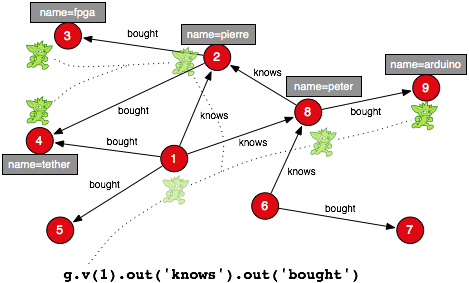
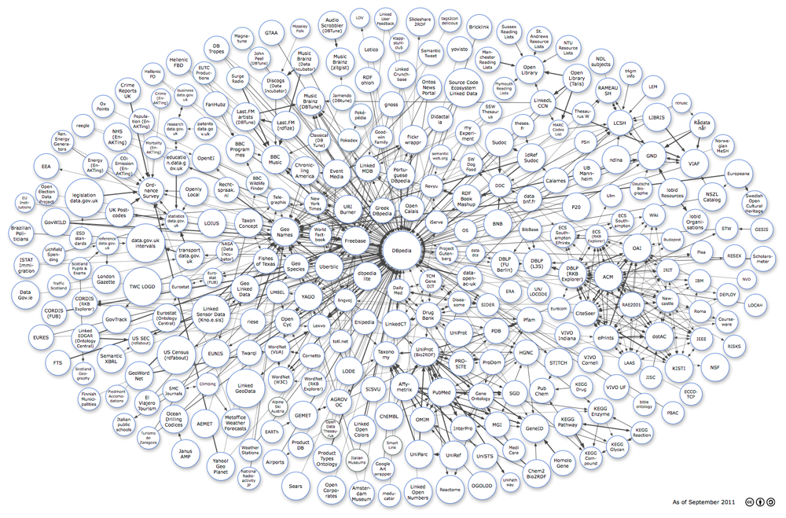

# Intro

-----

### What is Scarph

> "Scarph is not a scarf, it's a Scala garph"

Actually, it is an **embedded domain specific language** for accessing **graph databases** and building queries in a **type-safe manner**


-----

### Why it is useful

- a lot of information in the databases
- it's structured and highly interconnected
- we need to make some sense of it!


-----

### Why it is innovative

- you define graph schema
    + your queries conform to it
- solid theoretical foundation
    + _dagger categories_
    + _monoidal_ (even twice!) and _compact closed_


# Graph databases

-----

### Networks and graphs

- they are everywhere!
- it's just nodes and relationships
- social networks: Twitter, Facebook, Linkedin


<aside class="notes">
  - Graph database is a technology for data storage using graph structures, so that every element is directly linked to its neighbor element.
  - Graphs and networks surround us everywhere and are extremely useful for representing connected data.
</aside>


-----

### Property graph model

- labeled **vertices**
- labeled directed **edges** connecting vertices
- **properties** attached to vertices or edges


<aside class="notes">
  - How data is modeled in graph DBs
  - Props are like edges
</aside>

-----


### Bio4j data platform

<!--  -->

- A lot of protein related data:
    - Uniprot KB (SwissProt + Trembl)
    - Gene Ontology (GO)
    - UniRef (50,90,100)
    - NCBI Taxonomy
    - Expasy Enzyme DB
- Amazon Web Services infrastructure
- TitanDB backend

See [`bio4j.com`](http://bio4j.com)


# Graph query languages

-----

### What's a graph query


<aside class="notes">
  - social network is a graph (people, photos, friendship)
  - querying = traversing graph
</aside>


-----

### The zoo of languages

- SPARQL for RDF
- Cypher (only) for Neo4j
- Gremlin for anything Blueprints-compatible
- Pixy --- Prolog on top of Gremlin



<aside class="notes">
  - high diversity => no common foundation
  - all with diff features, but all aim to traverse graphs
  - they all treat graph without it's schema
</aside>


-----




-----


# Scarph features

-----

### Scarph is an EDSL

EDSL = Embedded Domain Specific Language

- implemented in Scala
- any code in Scarph is just Scala code!
- takes advantage of its advanced type system
- flexible & extensible


-----

### Defining graph schema in Scarph

```scala
object user extends Vertex {
  object name extends Property(user → String)
  object age  extends Property(user → Number)
}

object tweet extends Vertex {
  object text extends Property(tweet → String)
  object url  extends Property(tweet → URL)
}


object follows extends Edge(ManyOrNone(user) → ManyOrNone(user))

object posted extends Edge(ExactlyOne(user) → ManyOrNone(tweet)) {
  object time extends Property(posted → Date)
}
```


-----

### Static queries

- you can _write_  queries in one place
- but _execute_ them in another!
- you can _reuse_ them
- you can _rewrite_ them
- and they always _conform to the schema_


-----

### Independent implementations

- Different graph database technologies:
    + **TitanDB**
    - Neo4j
    - OrientDB
    - DEX/Sparksee
    - Bigdata
    - Bitsy
- `scarph-titan` is (almost) ready to use!


-----

### Pluggable syntax

> "get text of the tweets posted by someone's followers"

```scala
// arrows syntax
user <--(follows)--< user >--(posted)--> tweet.text
```

```scala
// flow syntax (Gremlin-like)
user.inV(follows).outV(posted).get(tweet.text)
```

```scala
// core syntax
inV(follows) >=> outV(posted) >=> get(tweet.text)
```


-----

### Query rewriting

- generic simplifications:
    + `A ⊗ I` is just `A`
    + `f >=> id` is just `f`
    + `(f ⊗ g).leftProj` is just `f`
- implementation and data-specific optimizations
- user-defined rewriting strategies


# Bio4j + Scarph = 😊

-----

### Bio4j schema


-----

### Bio4j schema


# Conclusion

-----

### Current state of the work

- Scarph query language is implemented and will be released soon
- TitanDB implementation of Scarph is almost ready
- integration of Scarph and Bio4j is in progress
- working on a theoretical paper about dagger categories for graph databases and query languages
- working on a technical paper about Scarph

-----

### Future work

- testing and benchmarking
- writing documentation
- more implementations (Neo4j, OrientDB)
- interactive query console
- query visualization and visual editing


-----

### Thanks for attention

- sources:
    + <https://github.com/ohnosequences/scarph>
    + <https://github.com/ohnosequences/scarph-titan>
- discussion:
    + <https://gitter.im/ohnosequences/scarph>
    + <aalekhin@ohnosequences.com>
